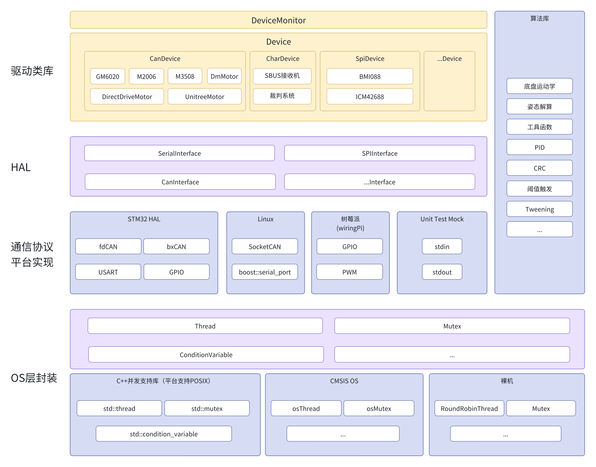

# 简介

**librm** 是一个面向 Robomaster 机器人开发的**跨平台嵌入式软件框架**，提供统一的硬件抽象层（HAL）、设备驱动和常用算法模块，让开发者能够在 **Linux** 和 **STM32** 平台上使用相同的 API 开发机器人应用。

## 解决的问题

在过去的 Robomaster 机器人开发中（尤其是电控方面），我们被以下这些问题困扰了很久：

1. 本可以统一实现的代码（比如电机驱动、pid 等一定会用到的模块）却可移植性不高，每辆车、每个人都在重复造这些轮子，一旦出现 bug，修复和维护难度极高，需要全队所有涉及到的成员互相沟通，浪费大量时间和精力。
2. 开发效率低下，很多算法和驱动只能在 STM32 上调试，无法在 PC 上快速验证。
3. 代码与特定硬件平台强耦合，无法在其他平台上运行或仿真

librm 通过提供统一的软件框架来解决这些问题：

- ✅ **统一的API** - 电机、传感器、通信设备、通用算法等接口一致，开箱即用。
- ✅ **跨平台开发** - 同一套代码可以在 STM32 和 Linux 上运行。如果需要开发新驱动，可以在 Linux 上开发调试，STM32 端不需要做任何修改就可以运行。
- ✅ **唯一上游** - librm 作为全队所有项目的上游代码库，所有人都使用同一套代码，bug 修复和功能更新可以同步到所有项目中，极大提升维护效率。

librm 由西安电子科技大学 IRobot 战队在 2024 赛季启动开发，并以 MIT 协议开源在 [Github](https://github.com/XDU-IRobot/librm) 上，欢迎各参赛队和机器人开发者使用，如果有任何问题或建议，欢迎提交 issue 或 pull request。

## 软件架构

